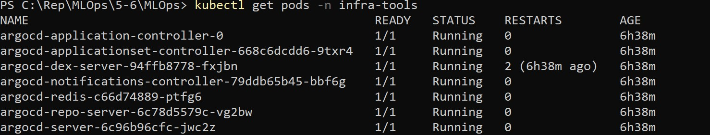
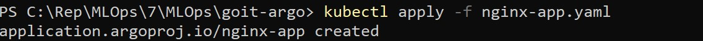
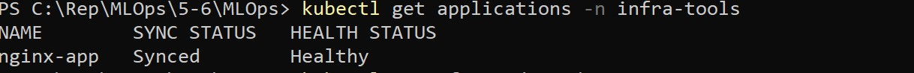
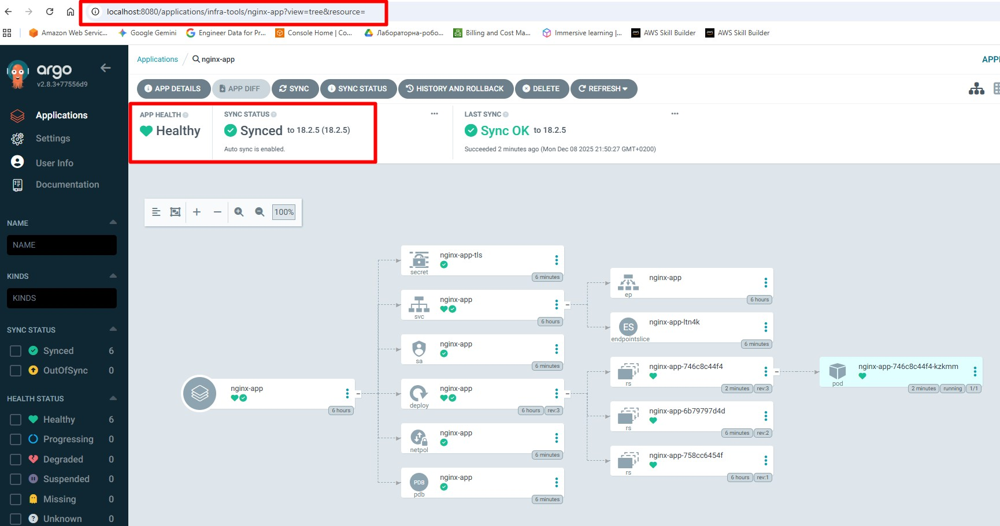
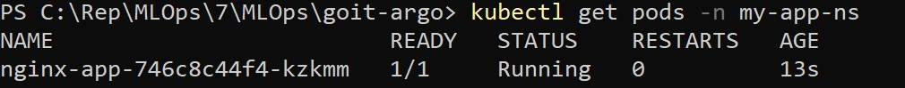
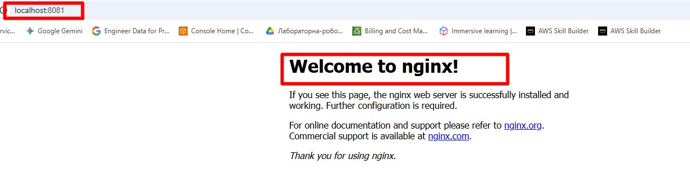

# GitOps with ArgoCD


## 1. Розгортання ArgoCD (Terraform)

1. Перейдіть у папку з Terraform кодом:
   ```bash
   cd terraform/argocd
   ```

2. Ініціалізуйте та застосуйте:
    ```bash
    terraform init
    terraform apply -auto-approve
    ```


3. Перевірте, що ArgoCD запустився:
    ```bash
    kubectl get pods -n infra-tools
    ```


## 2. Доступ до ArgoCD UI

1. Отримайте пароль адміністратора (початковий):
    ```bash
    [System.Text.Encoding]::UTF8.GetString([System.Convert]::FromBase64String((kubectl -n infra-tools get secret argocd-initial-admin-secret -o jsonpath="{.data.password}")))
    ```
2. Зробіть прокидання порту (Port Forward):
    ```bash
    kubectl port-forward svc/argocd-server -n ikubectl port-forward svc/argocd-server -n infra-tools 8080:80
    ```
3. Відкрийте у браузері: http://localhost:8080

-  Login: admin
-  Password: (той, що ви отримали у пункті 1)


Password: (той, що отримали у пункті 1)


##  3. Деплой застосунку (Helm через Argo)
1. Запуште репозиторій на GitHub.
2. Застосуйте маніфест Application у кластер:
   ```bash
    kubectl apply -f nginx-app.yaml
    ```

3. Перевірте статус у UI ArgoCD або через CLI:

    ```bash
    kubectl get applications -n infra-tools
    ```




4. Перевірте, що Nginx запустився:
    ```bash
    kubectl get pods -n my-app-ns
    ```



5. Зробіть прокидання порту (Port Forward):
     ```bash
    kubectl port-forward svc/nginx-app -n my-app-ns 8081:80
    ```
6. Відкрийте у браузері: http://localhost:8081




