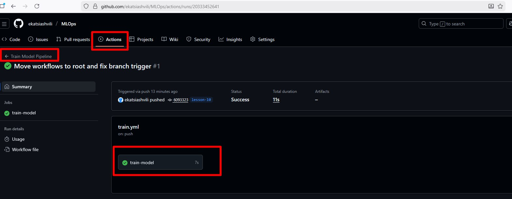
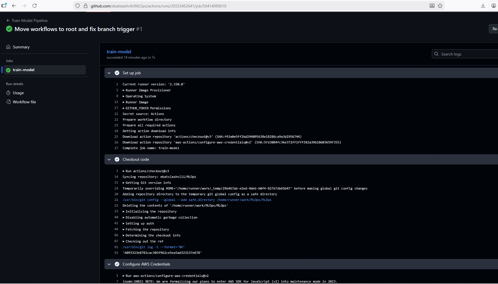
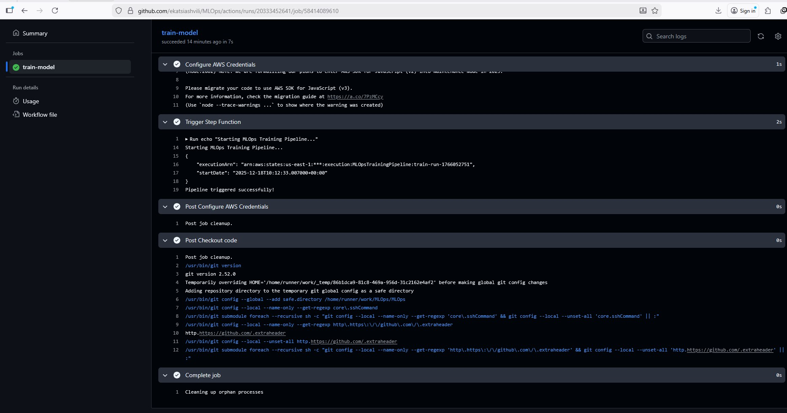
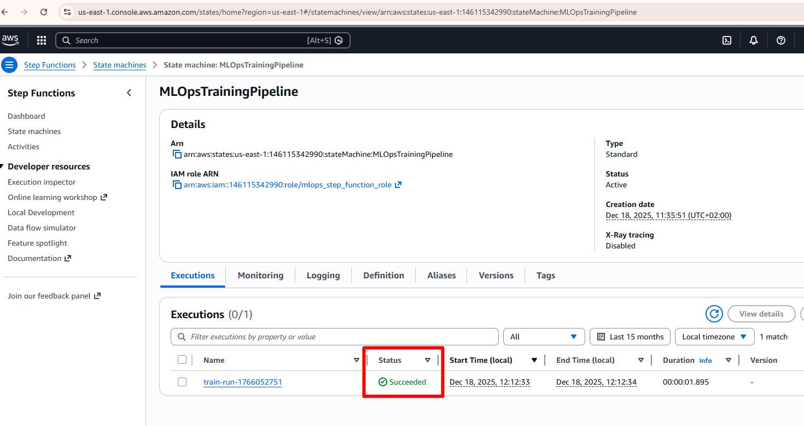
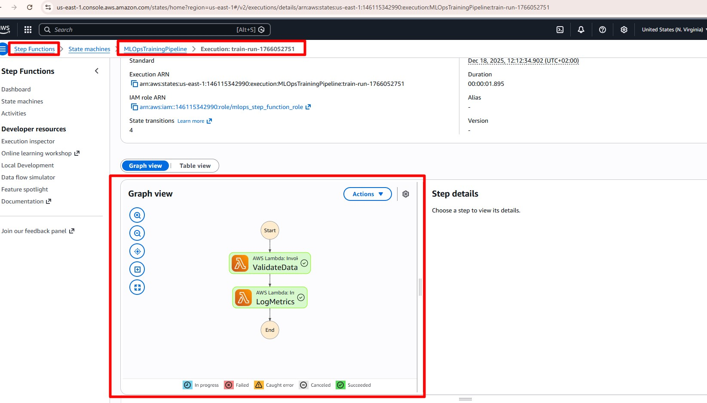
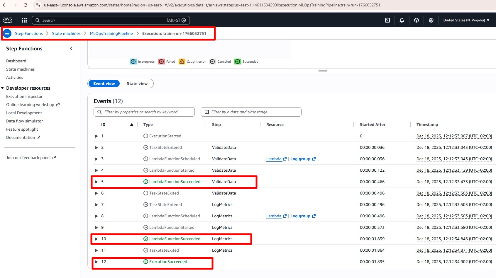

# Serverless MLOps Automation

Цей проект реалізує автоматизований пайплайн для тренування ML-моделей, використовуючи **AWS Step Functions**, **AWS Lambda** та **Terraform**.
Проект адаптовано для використання **GitHub Actions** як CI/CD інструменту.

  

## Архітектура

1.  **CI/CD (GitHub Actions):** Тригерить запуск при `git push`.
2.  **AWS Step Functions:** Оркеструє процес (Валідація -> Тренування).
3.  **AWS Lambda:** Виконує окремі задачі (перевірка даних, логування метрик).

---

## 1. Підготовка Lambda-архівів

Перед розгортанням інфраструктури необхідно зібрати Python-код у ZIP-архіви.

**Команда для збірки (PowerShell):**
```powershell
cd terraform/lambda
Compress-Archive -Path validate.py -DestinationPath validate.zip -Force
Compress-Archive -Path log_metrics.py -DestinationPath log_metrics.zip -Force
```
## 2. Розгортання інфраструктури (Terraform)
Вся інфраструктура (IAM ролі, Lambda функції, Step Function) описана у файлі main.tf.
#### Інструкція:

1. Перейдіть у папку Terraform:
```powershell
cd terraform
```

2. Ініціалізуйте та застосуйте конфігурацію:
```powershell
terraform init
terraform apply
```
3. Скопіюйте отриманий step_function_arn для налаштування CI/CD.

## 3. CI/CD та Змінні (GitHub Actions)
Автоматизація налаштована у файлі .github/workflows/train.yml. Пайплайн запускається автоматично при Push у будь-яку гілку.

Необхідні змінні (Secrets) у GitHub: Для коректної роботи додайте наступні секрети у Settings -> Secrets and variables -> Actions:

AWS_ACCESS_KEY_ID — Ваш ключ доступу AWS.

AWS_SECRET_ACCESS_KEY — Ваш секретний ключ AWS.

AWS_DEFAULT_REGION — Регіон розгортання (наприклад, us-east-1).

Приклад JSON (Payload)
CI/CD передає у Step Function наступний JSON-об'єкт:
```powershell
{
  "source": "github-actions",
  "commit": "6093323"
}
```






## 4. Ручний запуск Step Function
Ви також можете запустити пайплайн вручну через AWS Console.

#### Інструкція:

1. Зайдіть в AWS Console -> Step Functions.

2. Виберіть машину станів MLOpsTrainingPipeline.

3. Натисніть кнопку Start execution.

4. У поле Input введіть тестовий JSON:

```powershell
{
  "source": "manual_test"
}
```
5. Натисніть Start execution ще раз.
Результат виконання
Ви побачите візуалізацію проходження кроків (Graph View). Зелений колір означає успішне виконання.








## Очищення ресурсів
Щоб видалити всі створені ресурси:
```powershell
cd terraform
terraform destroy -auto-approve
```