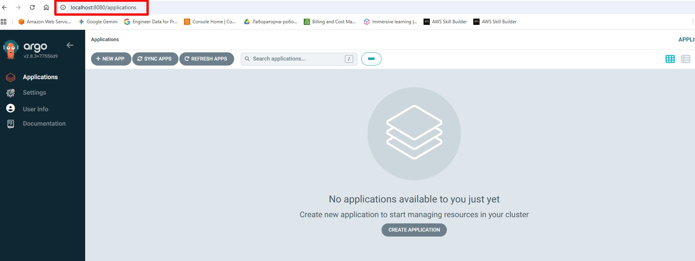
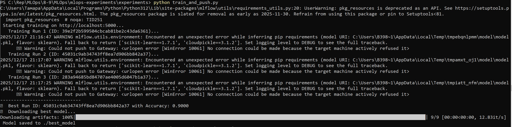
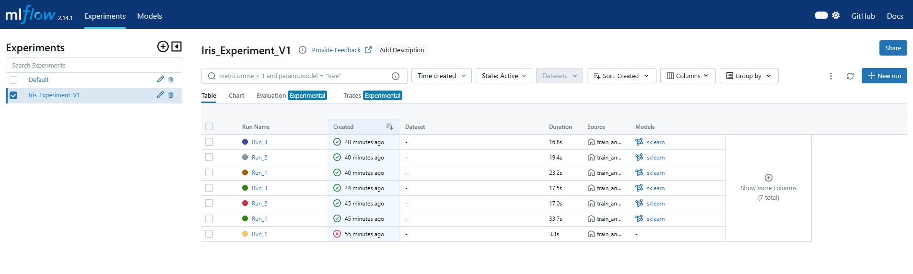
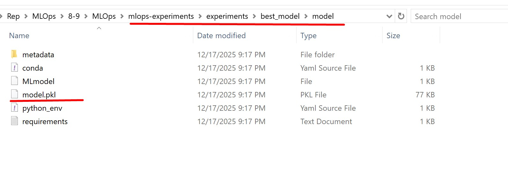
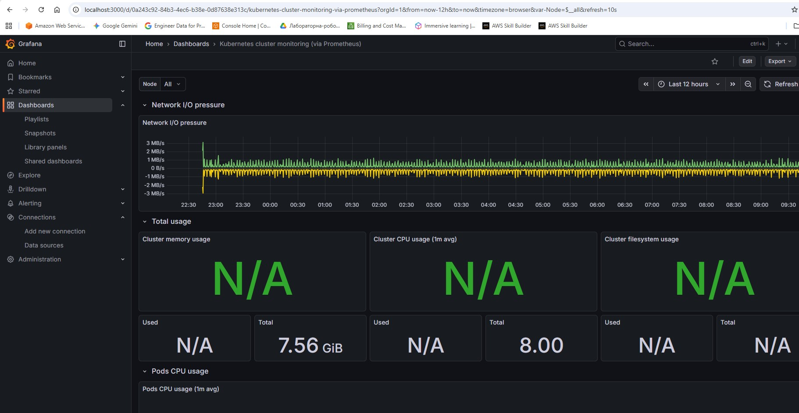
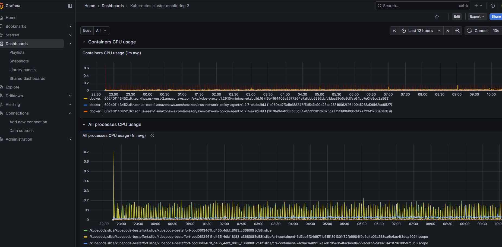

## MLOps Pipeline: MLflow + MinIO on Kubernetes
Цей проект демонструє повний цикл навчання моделі (Training Pipeline) з використанням MLflow для трекінгу та MinIO (S3) для зберігання артефактів у кластері Kubernetes.


## 1. Підготовка оточення (Python)

1. Встановіть необхідні бібліотеки (Важливо: версія клієнта MLflow має збігатися з версією сервера):

   ```bash
    pip install mlflow==2.14.1 boto3 scikit-learn pandas
    
    ```


2. Перевірте встановлену версію:
    ```bash
   pip show mlflow
    ```
(Має бути 2.14.1)

## 2. Розгортання інфраструктури (ArgoCD)

1. Застосуйте маніфест Application в кластер:
    ```bash
    kubectl apply -f argocd/applications/minio.yaml
    kubectl apply -f argocd/applications/postgres.yaml
    kubectl apply -f argocd/applications/pushgateway.yaml
    kubectl apply -f argocd/applications/mlflow.yaml
    ```

    
2. Перевірте, що всі поди перейшли у статус Running:
    ```bash
    kubectl get pods -n infra-tools
    ```

   ## 3. Доступ до сервісів (Port Forwarding)
 Оскільки сервіси знаходяться у приватному кластері, необхідно відкрити тунелі. Відкрийте два окремих термінали.

Термінал 1: Тунель до MinIO (S3 Storage)
1. Знайдіть ім'я пода MinIO та запустіть тунель:

   
     ```bash
      # Замініть minio-XXXX на ваше ім'я пода
    kubectl port-forward pod/minio-7c7c47bcc7-mkr4s -n infra-tools 9000:9000 9001:9001
    ```
Термінал 2: Тунель до MLflow (Tracking Server)
1. Знайдіть ім'я пода MLflow та запустіть тунель:
   ```bash
    # Замініть mlflow-XXXX на ваше ім'я пода
    kubectl port-forward pod/mlflow-6d9876cbf8-b9gqs -n infra-tools 5000:5000
    ```
##  4. Налаштування та запуск навчання

Відкрийте третій термінал (PowerShell) для запуску скрипта.

1.Встановіть змінні оточення (вказати шлях до локальних тунелів):

    ```bash
    $env:MLFLOW_S3_ENDPOINT_URL="http://localhost:9000"
    $env:AWS_ACCESS_KEY_ID="minioadmin"
    $env:AWS_SECRET_ACCESS_KEY="minioadminpassword"
    $env:MLFLOW_TRACKING_URI="http://localhost:5000"
    ```
2. Запустіть скрипт навчання:
    ```bash
    python experiments/train_and_push.py
    ```



##  5. Перевірка результатів
1. Перевірте логи скрипта. Він має автоматично обрати найкращу модель та завантажити її:
Best Run ID: ... with Accuracy: 0.9667
Downloading best model...
Model saved to ./best_model
2. Відкрийте MLflow UI у браузері: http://localhost:5000 Переконайтеся, що експеримент та Runs створені.




  3. Перевірте локальну папку з артефактами:

 ```bash
   
     ls ./best_model
```


##  6. Infrastructure Monitoring (Grafana)

Для моніторингу стану кластера та споживання ресурсів (CPU, Memory) сервісами MLflow та MinIO використовується стек Prometheus + Grafana.

1. Доступ до дашборду

Відкрийте тунель до сервісу:
 ```bash
   
     kubectl port-forward svc/grafana -n monitoring 3000:80
```

Відкрийте у браузері: http://localhost:3000

Login: admin

Password: Отримати командою:
 ```bash
   
    $pass = kubectl get secret grafana -n monitoring -o jsonpath="{.data.admin-password}"
[System.Text.Encoding]::UTF8.GetString([System.Convert]::FromBase64String($pass))
```
2. Візуалізація

Імпортуйте стандартний дашборд Kubernetes (ID: 315) або використовуйте JSON-файл з репозиторію.

У фільтрі Namespace оберіть infra-tools.

Ви побачите графіки навантаження на контейнери mlflow та minio.



Note:

 Business Metrics (Accuracy, Loss): доступні в інтерфейсі MLflow.

 System Metrics (CPU, RAM, Network): доступні в інтерфейсі Grafana.


