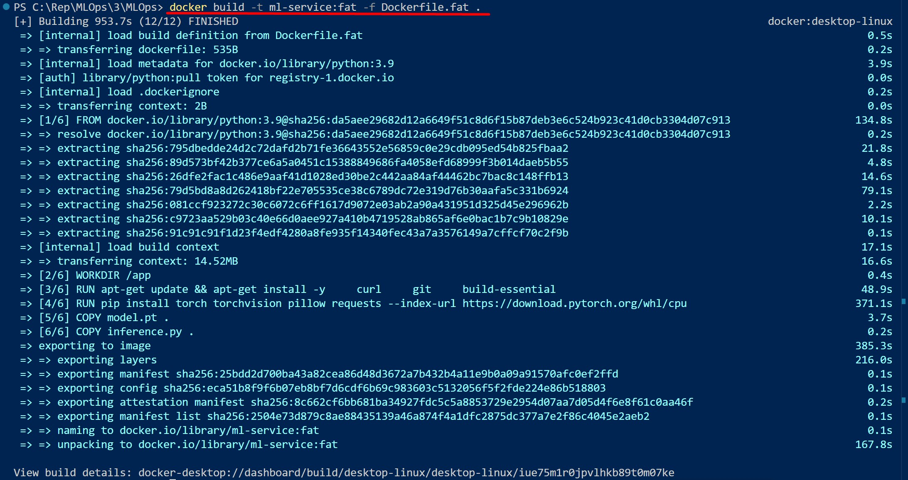
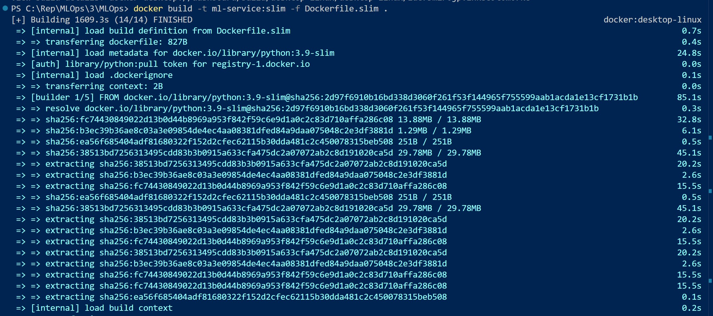
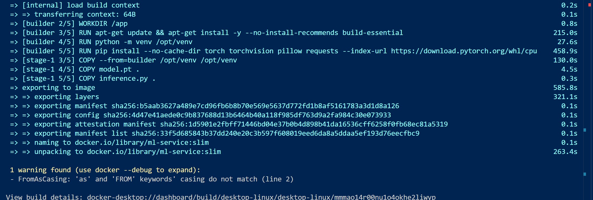
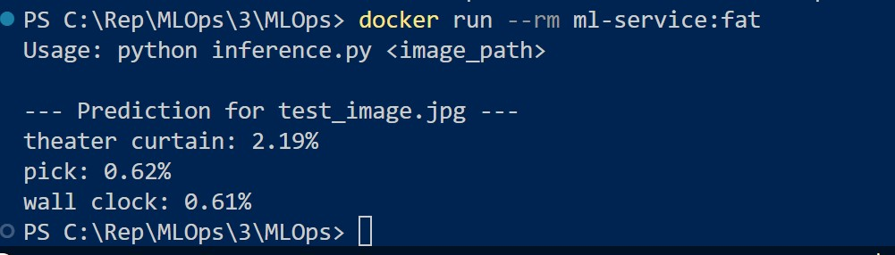
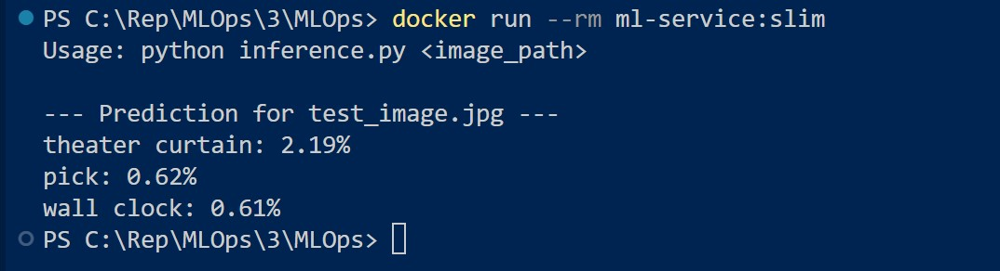
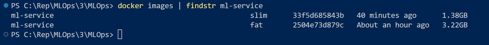

# MLOps Lesson 3
## Як запустити

### 1. Налаштування оточення:
**Дайте права на виконання та запустіть скрипт автоматичного налаштування:**
```sh
chmod +x install_dev_tools.sh
./install_dev_tools.sh
```
### 2.Експорт моделі: Завантажте модель та конвертуйте її в TorchScript.

**Після виконання має з'явитися файл model.pt.**
```sh
python export_model.py
```
### 3. Побудова образів:

**Побудова важкого образу (Fat):**
```sh
docker build -t ml-service:fat -f Dockerfile.fat .
```
 

**Побудова легкого образу (Slim):**
```sh
docker build -t ml-service:slim -f Dockerfile.slim .
```
  
   

### 4. Запуск та перевірка:

**Запуск Fat (створить тестове зображення всередині, якщо не передати файл):**
```sh
docker run --rm ml-service:fat
```
  

**Запуск Slim:**
```sh
docker run --rm ml-service:slim
```


**Перевірка розмірів та їх порівняння:**
```sh
docker images | findstr ml-service
```

  

**Чек-ліст виконання завдання:**

[x] Створено скрипт install_dev_tools.sh

[x] Експортовано модель через export_model.py

[x] Написано inference.py для передбачень

[x] Створено Dockerfile.fat (велика вага)

[x] Створено Dockerfile.slim (оптимізована вага)

[x] Порівняно розміри образів (Fat =3.22GB, slim =1.38GB)