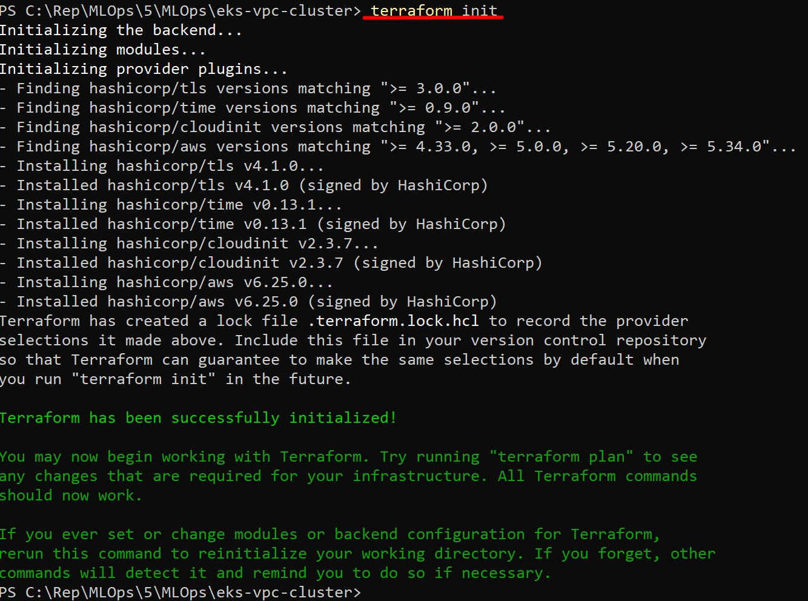
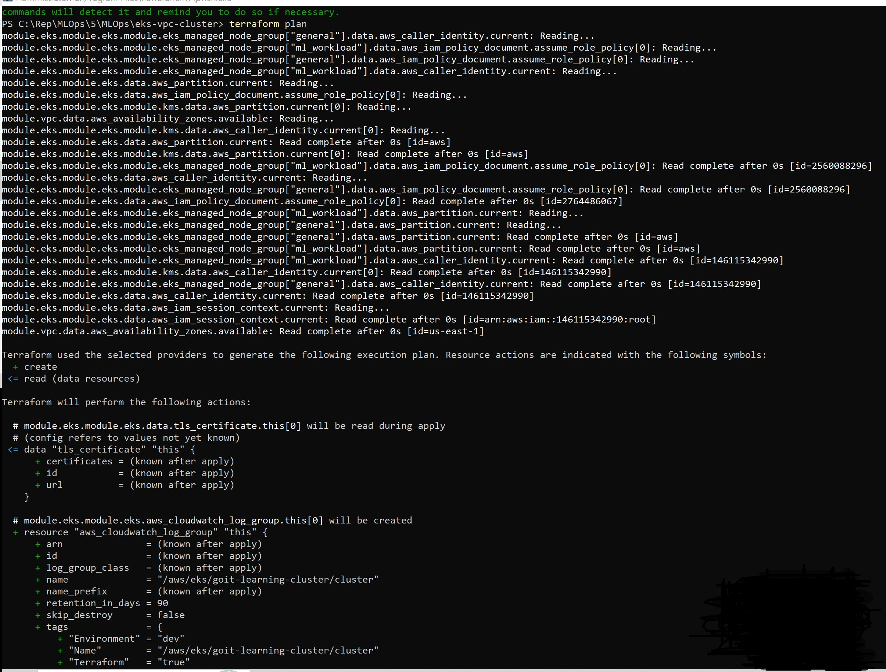
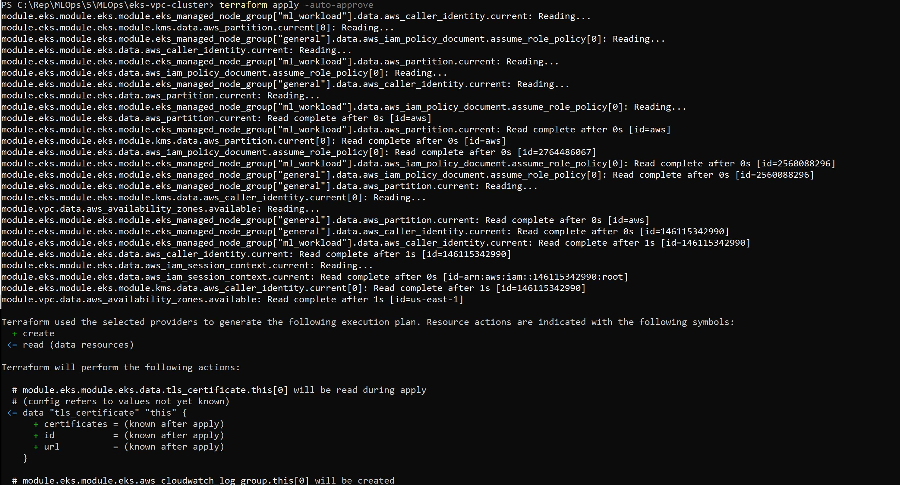
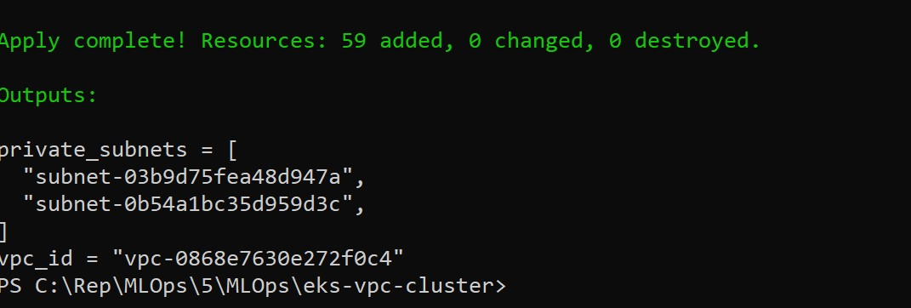
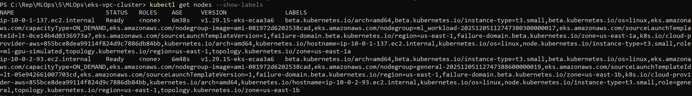
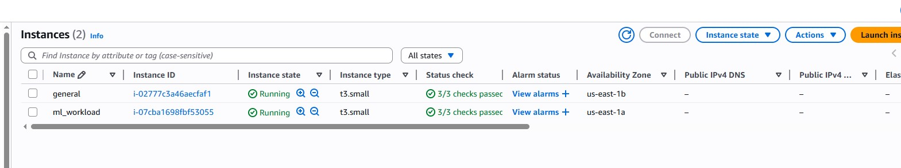
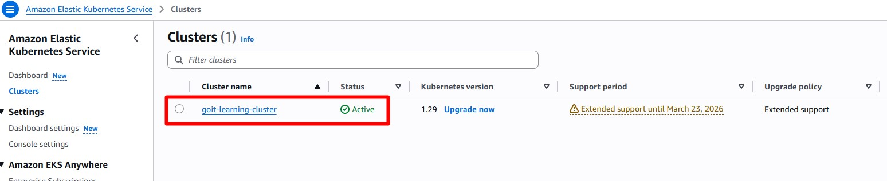
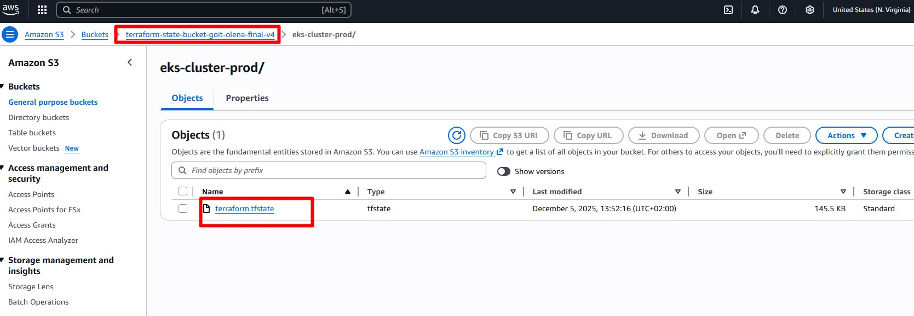
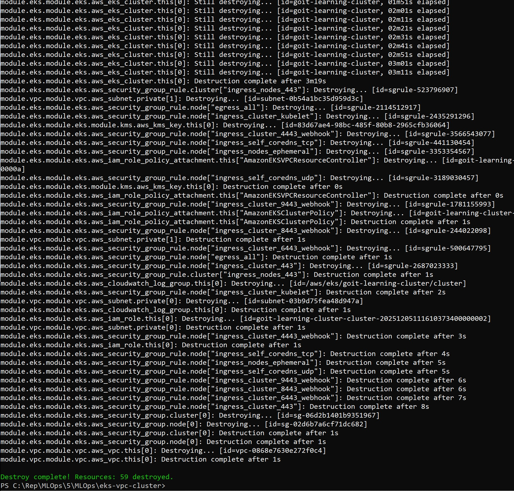

# AWS EKS & VPC Infrastructure with Terraform

Цей проект автоматизує розгортання Kubernetes кластера (EKS) та мережевої інфраструктури (VPC) в AWS, використовуючи модульний підхід Terraform.

## Структура проекту

Проект використовує архітектуру з єдиним кореневим модулем, який керує вкладеними локальними модулями:

```text
eks-vpc-cluster/
├── main.tf
├── variables.tf
├── outputs.tf
├── terraform.tf
├── backend.tf
├── vpc/
│   ├── main.tf
│   ├── variables.tf
│   ├── outputs.tf
│   ├── terraform.tf
│   └── backend.tf
├── eks/
│   ├── main.tf
│   ├── variables.tf
│   ├── outputs.tf
│   ├── terraform.tf
│   └── backend.tf
└── README.md
```
**Передумови**

**Перед запуском переконайтеся, що встановлено:**

1) Terraform (>= 1.0)
2) AWS CLI (налаштовано через aws configure)
3) kubectl

**Інструкція з розгортання**

1) Ініціалізація Terraform:

Завантаження необхідних модулів та плагінів:

```sh
terraform init
```


2) Перевірка плану:

Перегляд ресурсів, які будуть створені (VPC, Subnets, NAT Gateway, EKS Cluster, Node Groups).
```sh
terraform plan
```


3) Застосування змін:

```sh
terraform apply -auto-approve
```



4) Підключення до кластера:

```sh
aws eks --region us-east-1 update-kubeconfig --name goit-learning-cluster
```

5) Переконаймось, що ноди запустилися:

```sh
kubectl get nodes --show-labels
```


**Додатково перевіряємо в консолі AWS:**





6) Очищення ресурсів 
```sh
terraform destroy -auto-approve
```
